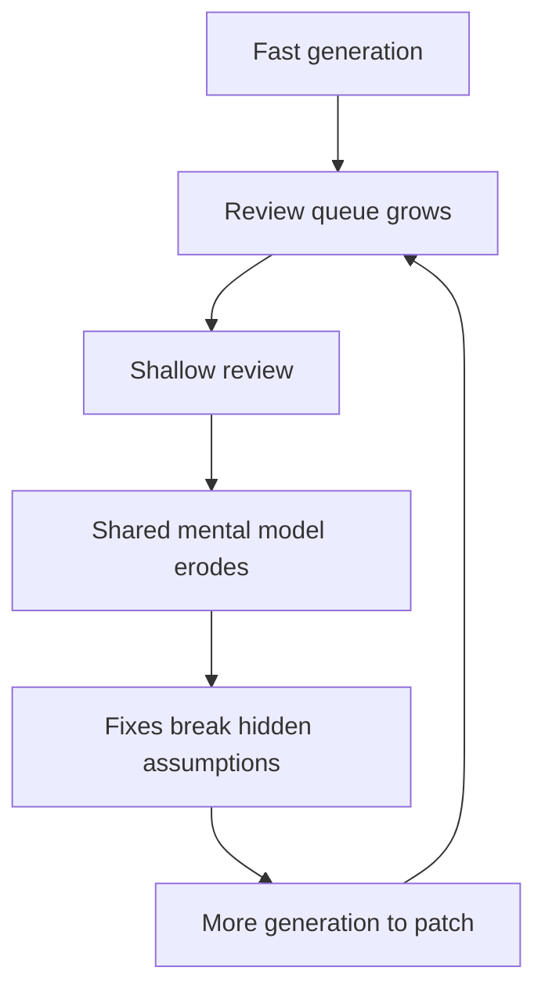

<!-- prettier-ignore -->
> ##### TL;DR
> {:.no_toc}
>
> - AI writes code fast, but teams ship **working products**, not code. Confusing coding velocity with delivery velocity is the first trap.
> - AI helps most when **implementation** is the bottleneck. When the constraint is requirements, architecture, validation, or ownership, faster generation just grows the review queue.
> - The data is sobering: DORA 2024 tied higher AI adoption to lower throughput and a 7.2% drop in delivery stability; METR found experienced developers were **19% slower** with AI while believing they were faster.
> - "AI slop" is code produced faster than a team can understand it. Generation scales; understanding does not.
> - The fix is not less AI but **more disciplined AI**: specify first, keep changes small, assign owners, protect the core, and measure outcomes instead of output.
{: .block-tip }

AI can write code remarkably fast. But software teams do not ship code; they ship working products. Confusing coding velocity with delivery velocity is the first trap of AI-assisted development.

## Where the Bottleneck Actually Is

AI creates clear gains when implementation is the bottleneck: generating boilerplate, test scaffolding, migrations, documentation, or well-specified features. But many projects are constrained elsewhere — uncertain product requirements, architectural decisions, customer feedback, hardware testing, regulatory validation, or cross-functional alignment. Generating code faster in these situations simply produces more work waiting for review.

| Constraint          | Example                                                  | Does faster codegen help?          |
| ------------------- | -------------------------------------------------------- | ---------------------------------- |
| Implementation      | Boilerplate, CRUD, migrations, test scaffolding          | Yes — large leverage               |
| Specification       | Unclear product requirements, shifting scope             | No — builds the wrong thing faster |
| Architecture        | Choosing boundaries, ownership of state, data model      | No — locks in guesses              |
| External validation | Hardware testing, regulatory sign-off, customer feedback | No — queue grows                   |
| Coordination        | Design reviews, cross-team alignment                     | No — more to coordinate            |

DoorDash CEO Tony Xu recently made this distinction: even when AI writes much of the code, engineers still spend substantial time on product reviews, design discussions, and coordination. Likewise, Google's [2024 DORA research](https://cloud.google.com/blog/products/devops-sre/announcing-the-2024-dora-report) found that greater AI adoption improved documentation and code-review speed, yet was associated with slightly lower delivery throughput and a 7.2% reduction in delivery stability. Local acceleration did not automatically improve the whole system.

The effect can be even more surprising in mature codebases. In a randomized study of 16 experienced open-source developers completing 246 real issues, [METR found](https://metr.org/blog/2025-07-10-early-2025-ai-experienced-os-dev-study/) that AI tools made developers 19% slower. The developers expected a 24% speedup and still believed afterward that AI had accelerated them. Reviewing and correcting plausible-but-imperfect output consumed the apparent gain.

<!-- prettier-ignore -->
> ##### NOTE
> {:.no_toc}
>
> The perception gap is the dangerous part. If a tool makes you slower while making you _feel_ faster, no amount of self-reported productivity will catch it. Only measured outcomes will.
{: .block-warning }

## The Rise of AI Slop

AI slop is not merely ugly code. It is code produced faster than a team can understand it: duplicated logic, unnecessary abstractions, inconsistent assumptions, shallow tests, and comments that describe syntax without explaining intent. Each change may look reasonable in isolation while the system gradually loses coherence.

In the [2025 Stack Overflow survey](https://survey.stackoverflow.co/2025/ai), 66% of developers reported frustration with AI solutions that were "almost right," while 45% said debugging AI-generated code took longer. Flask creator Armin Ronacher similarly described hearing from engineers who [no longer know what is inside their own codebases](https://lucumr.pocoo.org/2026/2/13/the-final-bottleneck/). Generation scales; understanding does not.

The failure mode is a feedback loop, not a single bad commit:

### A Subscription System, Six Months Later

Imagine a team using agents to build a subscription system. Within days, it has billing, retries, discounts, caching, and entitlement checks. Months later, an unusual renewal failure appears. The business rules are scattered across generated handlers and background jobs, and nobody knows which component owns the true state. Each attempted fix breaks another assumption. Rebuilding the workflow around an explicit state machine may become safer than continuing to patch it.

The real failure was not one bad function; it was the loss of a shared mental model.

## A Field Guide for Disciplined AI

The answer is not less AI, but more disciplined AI.

| Practice                                                                  | What it protects                          |
| ------------------------------------------------------------------------- | ----------------------------------------- |
| Specify behavior and acceptance tests **before** generating code          | Building the right thing                  |
| Keep AI-authored changes small and reviewable                             | Review depth; the ability to say no       |
| Assign an owner who can explain every production change                   | The shared mental model                   |
| Protect core architecture, invariants, and performance-critical paths     | Coherence where it matters most           |
| Measure cycle time, failures, and rework — not lines of code or PR volume | Honest signal about whether it is working |

Each of these is cheap compared to the alternative. A spec takes an hour; an unowned billing state machine takes a quarter to unwind.

## Closing

AI amplifies the system around it. When coding is the constraint, it can create enormous leverage. When clarity, validation, or ownership is the constraint, faster generation merely creates a larger queue — and eventually, a more expensive rewrite.

The question to ask before reaching for an agent is not "can it write this?" but "is writing this the slow part?"
